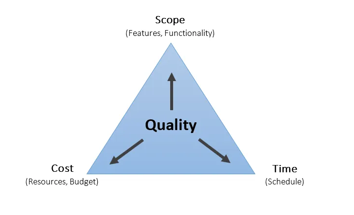
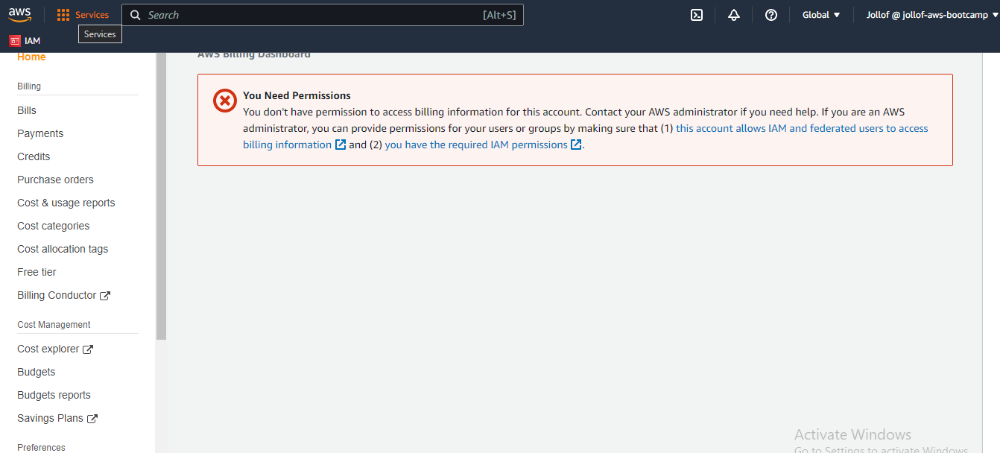
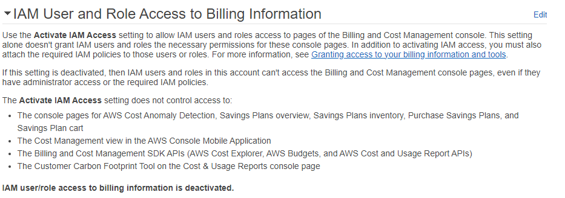
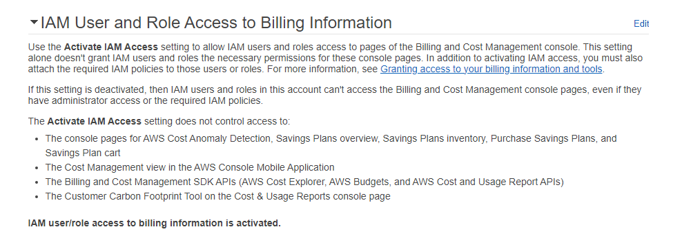
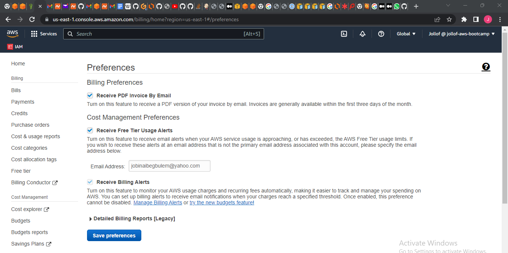
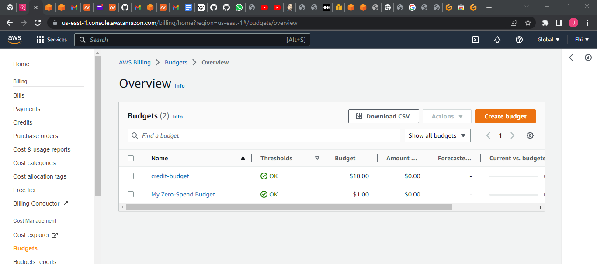
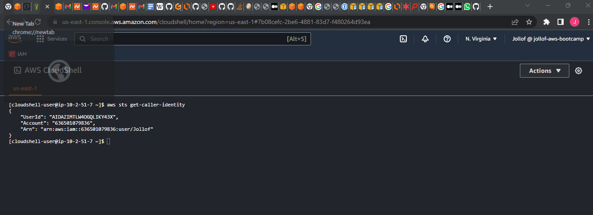
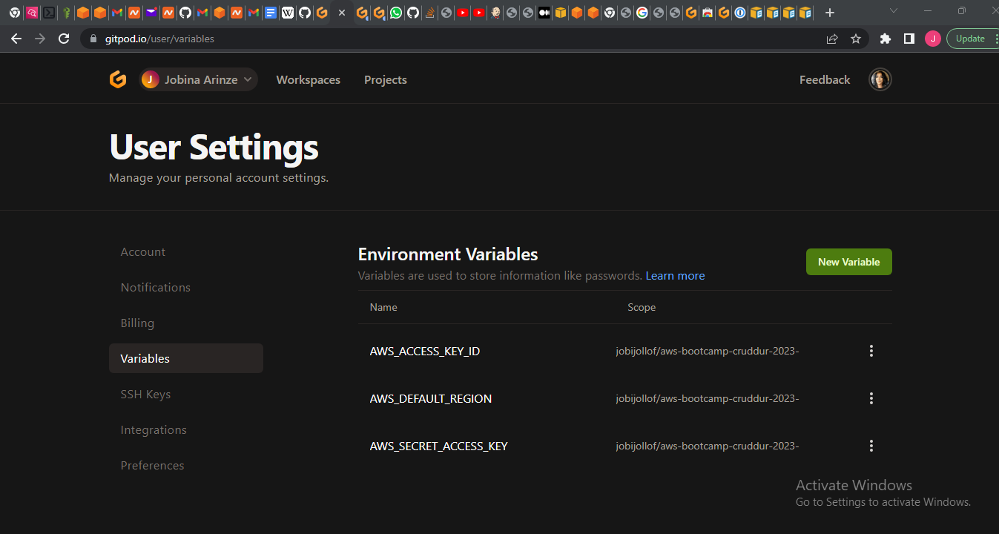

# Week 0 — Billing and Architecture

### Overview of the boot camp:

Bootcamp classes take place every Saturday. Anything that doesn't get in class covered will be covered with an extra video. It is a 14 weeks boot camp(Andrew thinks more weeks may be added) 😀💃 
The boot-camp is focused on building a cloud workload. Each week builds off the other. There is homework. There is grading. There are digital badges. It is free. It is a bring your-own-account bootcamp(There may be spend however Chirag is helping to keep it at a minimal level)Thank you Chirag 😊

### What are we building:

An app called Cruddur.

It will have the same features as twitter. 

It is a disposable micro-blogging platform.

### Tools for building:

1. SQL and No SQL databases

2. Realtime modern APis

3. Multiple containers services(*microservices)

4. A CI/CD pipeline

5. Decentralized Authentication and more

### Prerequisites:

- Create a github [account](https://www.youtube.com/watch?v=rirBD2CZZXQ&list=PLBfufR7vyJJ7k25byhRXJldB5AiwgNnWv&index=2)

- Set up [MFA](https://www.youtube.com/watch?v=oDSeqvRmEUI&list=PLBfufR7vyJJ7k25byhRXJldB5AiwgNnWv&index=3)

- Create a gitpod [account](https://www.youtube.com/watch?v=yh9kz9Sh1T8&list=PLBfufR7vyJJ7k25byhRXJldB5AiwgNnWv&index=4)

- Create github [code space](https://www.youtube.com/watch?v=yh9kz9Sh1T8&list=PLBfufR7vyJJ7k25byhRXJldB5AiwgNnWv&index=4)

- Add the github [extension](https://www.youtube.com/watch?v=A6_c-hJmehs&list=PLBfufR7vyJJ7k25byhRXJldB5AiwgNnWv&index=5)

- Create your github [code space](https://www.youtube.com/watch?v=OwFVrU5B3xs&list=PLBfufR7vyJJ7k25byhRXJldB5AiwgNnWv&index=6)

- Create an AWS [account](https://www.youtube.com/watch?v=uZT8dA3G-S4&list=PLBfufR7vyJJ7k25byhRXJldB5AiwgNnWv&index=7)

- Create a [template](https://www.youtube.com/watch?v=8cxYgaMB9ow&list=PLBfufR7vyJJ7k25byhRXJldB5AiwgNnWv&index=8) from the boot camp repository

- Create a [Lucid chart account](https://www.youtube.com/watch?v=bgFzBYLT3sU&list=PLBfufR7vyJJ7k25byhRXJldB5AiwgNnWv&index=9)

- Create [Honeycomb.io account](https://www.youtube.com/watch?v=7IwtVLfSD0o&list=PLBfufR7vyJJ7k25byhRXJldB5AiwgNnWv&index=10)

- Create [Rollbar account](https://www.youtube.com/watch?v=Lpm6oAP3Fb0&list=PLBfufR7vyJJ7k25byhRXJldB5AiwgNnWv&index=11)


### What are we building:

An  app called Cruddur.

A replica of twitter.  It differs from twitter in the sense that it is a disposable micro-blogging platform.

### Tools for building:

1. SQL and No SQL databases

2. Realtime modern APis

3. Multiple containers services(*microservices)

4. A CI/CD pipeline

5. Decentralized Authentication and more


### Week 0 Guest instructors:

- Margaret Valtierra (AWS Community hero)
- Chris Williams (AWS Community hero)


### Project Scenario:

User Persona: Technical role play. This style of teaching will eventually help me think like my stakeholders 
First day of employment. I have no idea what I am building but I have heard interesting things to pique my interest also the pay is too good to leave on the table.
I know it's a start-up called Cruddur a microblogging site. Ooops forgot to introduce myself - Jobina Arinze and I am a cloud Engineer.

### Teams involved :

HR - Interviewer

Founder

Investors and Board of directors(They buy into the idea of the founder)

Fractional CTO- Someone partly committed to the company (They split their time between the startup and consulting in this case Andrew brown? smiley)

Marketing team: (This is the team  that will generate content)

### Cruddur Users:

The team is yet to decide whether it going to be used by university students, or young professionals or to expand to other user types.
(This creates the issue of age authentication and generating age-appropriate content)
Short-lived content has to be engaging and exciting so that people keep coming back to the app.
Cruddur is an ephemeral micro-blogging platform. We have to build an app that creates a sense of community and trust in users
It is an expiring social media platform. Shares a lot of content but will not track the users long term.


### Bear in mind:

That the content will be catchy and hopefully attract a lot of users and scale quickly. 
(This raises the issue of frequent authentication and things that need to work quickly without fail)
How to manage ephemeral content.
The app's selling point is its ephemeral nature. Creating a sense of community, leading to trust by its users 

### What Cruddur has this week:

- A domain name

- An Aws Account  

### Architecture: 

Projections, ORM(object-relational mapping) Monolithic Apps, Functional components or requirements.A good technical road map. Sprints and Agile methodology 
Do the work incrementally.
Microservice is advised please avoid monolithic architecture.

### Why AWS:

Foremost microservice provider and they are great at it.
 

### Budget:

Keep spend as little as possible. This introduces us to the iron triangle of Project management, 

 

Essentially you get scope, cost, and time. You have to mostly choose two. (quick and cheap will sacrifice scope. Very expensive then you have to consider time)
The main thing is to find a way to balance all three of them. Also, always keep the iron triangle concept in mind at the very start of every project.

### Cruddur Requirements:

- Frontend- Javascript using react 

- Backend - Python using flask(python is the most popular language for cloud)

- API- microservices avoid a monolith architecture.


### Architecting Solutions:

Crucial to the creation and functioning of the  Cruddur app is good architecture.
What is good architecture? In order to decipher what good architecture is we have to consider the following (RRACs):
1. Requirements

2. Risk

3. Assumptions

4. Constraints

Requirements - These are things that the project must achieve at the end.

Requirements for Cruddur

1. Ephemeral

2. Looks like Twitter

requirements must be

- Verifiable

- Monitorable

- Traceable

- Feasible

Risk- Something that prevents your requirement from being successful

- SPOFs (Single points of failure)

- User commitment(Are users going to get hooked or not)

- Late delivery

Assumptions- Opinions we are holding as true at the planning and implementation stages

- Sufficient network bandwidth

- Stakeholders will be available

- Budget is approved 

Constraints- These are policy or technical limitations for the project
For Cruddur,
- Time (14+ weeks)

- Budget (zero budget spend we are leveraging on AWS free tier)

- Vendor selection

After considering RRACS we move to the actual designing 

Conceptual Design
- created by business stakeholders and architects

- organizes and defines concepts and rules

- napkin design


This is the lowest level of design. It involves no technicalities. 


Logical Design- This is like the blueprint in which we are going to stand things on 

- Defines how the system should be implemented

- Environment without actual names or sizes

- Example:undeployed CFT 


Physical Design- This the actual house that is built. (app) It is a fall out of the blue print

- Representation of the actual thing that was built

- IP addresses, Ec2 instances or serverless, everything is on the physical design
 

In order to achieve the RRACs, it is super important to develop a common dictionary. 

in developing a common dictionary we have to ask 'dumb question'. No assumptions be ready to always 
ask questions like:

- What are we trying to do?

- How is it going to make money?

- What kind of skill sets do we have available internally or are we going to outsource

- How are we going to achieve this given the skill set available and the time frame provided.

Play be the packet when you play be the packet, you can see what you are building from your customers eyes, from the moment they decide to click on the url of the app. Questions like do they get to be authenticated first and every other scenarios will come to play. This just basically seeing the app from the users eyes.  

- Document everything

### TOGAF: What is TOGAF

"This is an architecture framework that provides the methods and tools for assisting in the acceptance,
production,use and maintenance of an enterprise architecture. It is based on an iterative  process model supported by best practices
and a re-useable set of existing architecture assets" It is acronym for Open Group Architecture Framework, is intended to to a standard way to design and implement 
architectures for very large computer systems.

- The most popular framework for architects

- Common dictionary of words to convey desired outcomes

- Meta model for creation of underlying projects

- Maps closely with AWS well architected framework

Closely related to TOGAF IS C4 model,which stands for connection,collaboration,communication and customers. The are others, like Zachman, Dodaf etc. None is better than the other. They all help to break down complex architectures to the barest simplistic term.

### AWS well-Architected framework

This is a tool provided by AWS. It gives you a compilation of questions that you can ask your team, investors etc. These questions are 
being asked from the 6 pillars of well architected framework which are 
- Operational excellence

- Security

- Reliability

- Performance efficiency- How well is your system performing. How do you pick the best performing architecture(are picking between Ec2 or going serverless)

- Cost optimization - How do get the most value for money

- Sustainability - Company sustainability goals asking and getting answers from clients  will help to extract RRCAs.

### Billing:

You have to login as root user to view billing data. If you want the IAM user to have access to billing data you have have to grant permissions. (I tried it and got the error)



To sort out the error, i logged in as root user on the drop down by my username i clicked on

`account`

i scrolled down to `IAM User Role Access to billing information` on the top right corner  i clicked on edit
 

I checked the box to `activate access to the billing and cost management console pages`
I updated.



Pricing varies according to region

I set up billing alert with this [tutorial](https://youtu.be/OVw3RrlP-sI)

To set billing alert go to the billing dashboard click on

`billing preferences`


Fill out all the parameters and `save`




### Security:

The CISO chief information security officer responsible for an organization's information and data security. 
I enabled MFA for the root user
I also enabled MFA for IAM user using google authenticator.
I Enabled Cloudtrail for auditing most API calls
There are three types of users IAM User, Human user, System user 
IAM user is a global service
IAM Roles- I AM roles manage who has permission to resources on AWS
IAM policies - Controls their permission 

### Budgets:
Two budgets are free for the free tier.
I created a credit budget and a zero-spend budget. The zero spend is actually a $1 budget. It notifies you when your spend
exceeds $0.01. 
I Created thresholds for the budgets I created at 50%, 85%, and 100% of the actual budget.


### Cloudshell:

Used cloud shell to generate credentials



### Install AWS CLI:
The root user has MFA.
Created a new user added the user to a group and granted the user full administrative access. (It is recommended that people are given just the permissions they need.)
Least privilege(Security best practice)
I used gitpod to download aws CLI for linux system with the following command

```
curl "https://awscli.amazonaws.com/awscli-exe-linux-x86_64.zip" -o "awscliv2.zip"
unzip awscliv2.zip
sudo ./aws/install

```
After downloading i ran:

`aws configure`

AWS access key ID:

AWS secret access key:

Default region Name: us-east-1

Default output format: json

These questions have to be answered correctly to configure Aws CLI correctly. After this, i ran 

`aws sts-get-caller-identity`

This command basically identifies the user.

🤭 0oops watched more of this [tutorial](https://youtu.be/OdUnNuKylHg)) and this was the wrong thing to do.

To delete the configuration, i  had to run `nano ~/.aws/config` and `nano ~/.aws/credentials`.

💃Yeepppee back in business. According to this [video](https://youtu.be/OdUnNuKylHg) i am meant
to export  my credentials. To export credentials i ran:

`export AWS_ACCESS_KEY_ID="your access id"`

`export AWS_SECRET_ACCESS_KEY=" access key"`

`export AWS_DEFAULT_REGION= "region"`

Copied and pasted the commands into my gitpod terminal one at a time.

Confirmed if i set it right by typing `env | grep AWS_`  The output for this was my details  

Typed `aws sts get-caller-identity` and my User Id, Account and Arn was the output

Told gitpod to remember these credentials next time i open your workspace. by typing the following commands.
`gp env AWS_ACCESS_KEY_ID=""`

`gp env AWS_SECRET_ACCESS_KEY=""`

`gp env AWS_DEFAULT_REGION=us-east-1`

Checked variables on my gitpod profile to make sure my credentials were properly exported. 


I tried to push to main and had permission issues.I had not authorized gitpod to push to github
I logged into [here]https://gitpod.io/access-control/ and granted gitpod the required permission.


 


